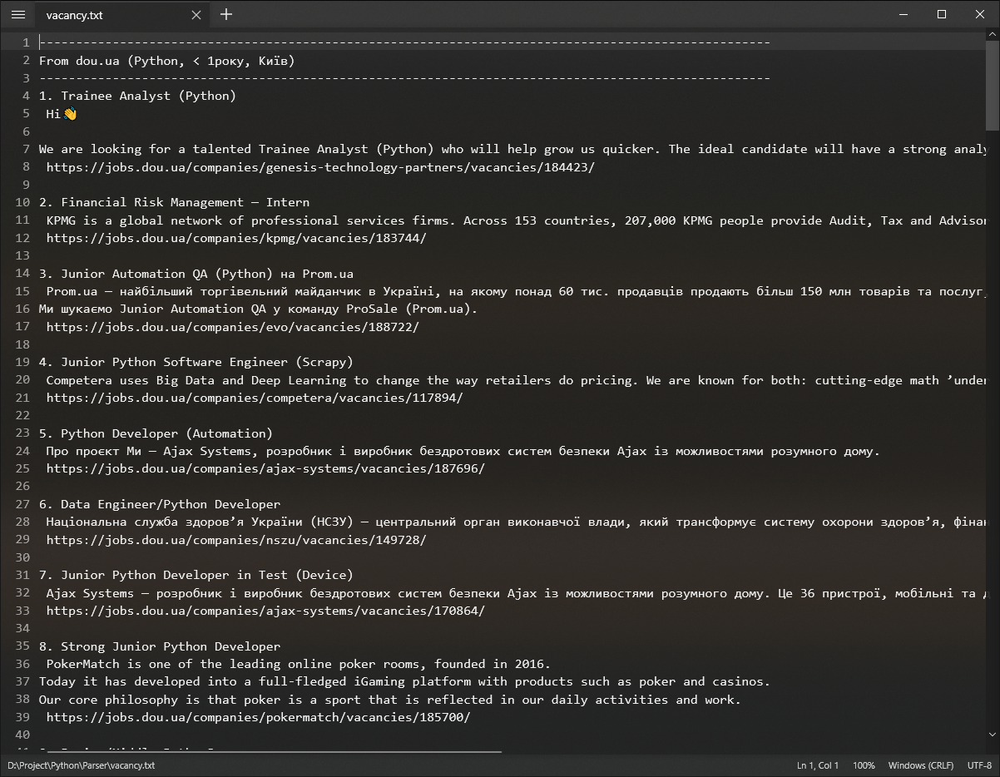

# Vacancy parser<br />
I wrote this program to monitor vacancies from different sites at the click of one button. The program takes information from the following sites: djinni.co, dou.ua, work.ua<br />



# Download & Setup Instructions :
* Clone the project. This will download the GitHub respository files onto your local machine.</br>
```Shell
git clone https://github.com/teredet/Kyvi-calculator
```
* Create a virtual environment and activate
```Shell
    pip install virtualenv
    python -m virtualenv envname
    envname\scripts\activate
```
* Install requirements
```Shell
    cd Parser
    pip install -r requirements.txt
```
* Run program
```Shell
    python parser.py
```

# Features
* At the moment, it turned out to implement the receipt of all vacancies upon request from the site djinni.co and work.ua.
* From the site dou.ua I managed to get only the last 20 vacancies.
# Tech Stack
* Python
* BeautifulSoup4
* Requests

 